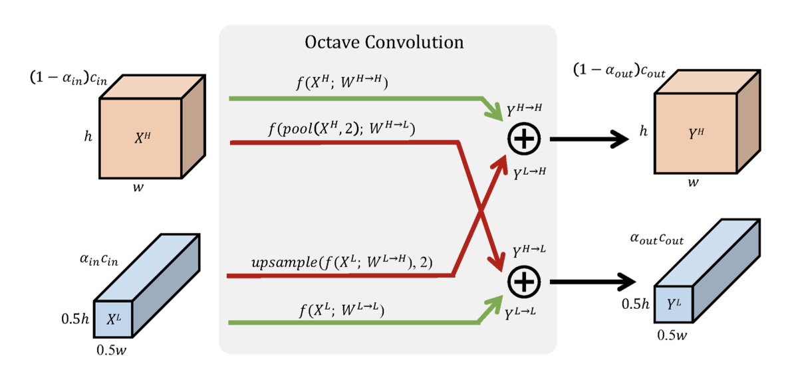
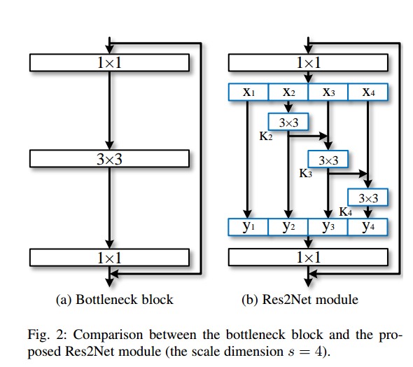
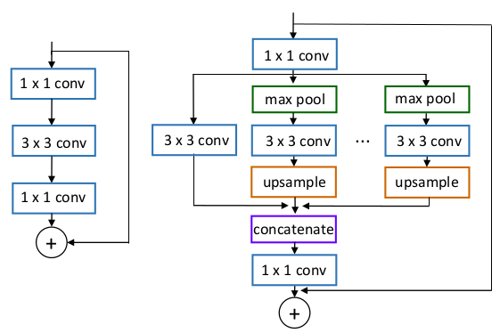
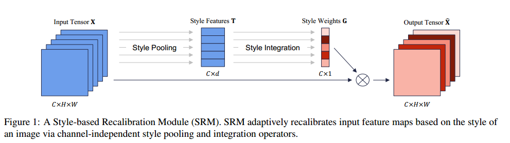

# OctaveConv_pytorch
## Pytorch implementation of Octave convolution with other similar operation
  This is **third parity** implementation(un-official) of Following Paper which are talked in [Recente_Convolution.pdf](https://github.com/lxtGH/OctaveConv_pytorch/blob/master/Recent_Convolution.pdf):
  1. Drop an Octave: Reducing Spatial Redundancy in Convolutional Neural Networks with Octave Convolution.
  [paper](https://arxiv.org/pdf/1904.05049)
  
  2. Adaptively Connected Neural Networks.(CVPR 2019)
  [paper](https://arxiv.org/abs/1904.03579)
  
  3. Res2net:A New Multi-scale Backbone Architecture
  [paper](https://arxiv.org/abs/1904.01169)
  
  4. ScaleNet:Data-Driven Neuron Allocation for Scale Aggregation Networks 
  [paper](https://arxiv.org/pdf/1904.09460)
  
  5. SRM : A Style-based Recalibration Module for Convolutional Neural Networks
  [paper](https://arxiv.org/abs/1903.10829)
  

### Plan
1. add Res2Net bolock with SE-layer (done)
2. add Adaptive-Convolution: both pixel-aware and dataset-aware (done)
3. Train code on Imagenet. (done)
4. Support more models. ()

### Usage
   check model files under the fig/nn floder.
   
```python
from lib.nn.OCtaveResnet import resnet50
from lib.nn.res2net import se_resnet50
from lib.nn.AdaptiveConvResnet import PixelAwareResnet50, DataSetAwareResnet50

model = resnet50().cuda()
model = se_resnet50().cuda()
model = PixelAwareResnet50().cuda()
model = DataSetAwareResnet50().cuda()

```

## Reference:
  1. OctaveConv: MXNet implementation [here](https://github.com/terrychenism/OctaveConv)
  2. AdaptiveCov: Offical tensorflow implementation [here](https://github.com/wanggrun/Adaptively-Connected-Neural-Networks)  
  3. ScaleNet: [here](https://github.com/Eli-YiLi/ScaleNet)
  4. SGENet:[here](https://github.com/implus/PytorchInsight)
## License
    MIT License
